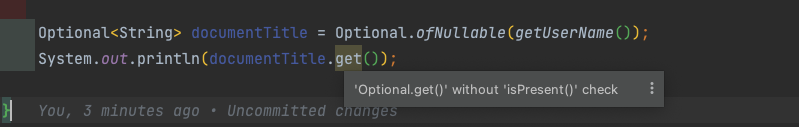

Every developer must have encountered a Null Pointer Exception at least once in their career (1 is an understatement). Most modern programming languages offer ways to represent empty values instead of just using a `null` reference. `Optionals` in java is something like that.

But this is not a "one size fits all" tool that would magically make your code null safe. In fact , depending on where you use `Optionals`, it can make the code counterintuitive

## How Optionals Help

I think the [first sentence in Javadoc](https://docs.oracle.com/javase/8/docs/api/java/util/Optional.html) pretty much sums up how optional are useful for handling nulls.

> The Optional class is a container object which may or may not contain a non-null value.

When you wrap a value in an `Optional` class, it is immedeatly clear that the value may or may not exists. Optionals also provide a set of convenient operations such as map, filter, and flat map to perform logic on the values without worrying about null pointer exceptions.

You can wrap a value in optional like shown below

```java
String name = "Gallahad";
Optional<String> name = Optional.of(name)

String age = null;
Optional<String> age = Optional.ofNullable(age);
```

And then when it's time to fetch the value from the optional, you can do it like so.

```java
if(name.isPresent()){
	System.out.println(name.get());
}

// --- or this way ---

name.ifPresent(it->System.out.println(it));
```

Now lets look at the common ways in which the `Optional` class can be wrongly used

## Avoid using .get() directly

A common mistake that beginners make is using the `.get()` method directly. If the value is not present in the optional object, it will throw a `NoSuchElementException`

> if you ask me, i think the `get` method seems counter intuitive in the optional class. Its not very apparent that `get` is unsafe. Even the documentation suggests calling `orElseThrow()` instead, as it is explict from the name that
> an exception will be thrown

```java
Optional<String> documentTitle = Optional.ofNullable(getDocumentTitle());
System.out.println(documentTitle.get()); // will throw NoSuchElementException
```

As mentioned earlier, the intent of wrapping a value with Optional is that , the user will have to check if the value is present before accessing it.

IDEs such as IntelliJ display warning messages when using Optionals without checks. Make sure you look out for that warning



Optional class provide following methods to check presence of value and perform operations

- using `isPresent()` or `isEmpty()` to check value exists in optional
- using `ifPresent()/ifPresentOrElse()` to peform an operation, only if a vaule exists in optional
- using `orElse(defaultVal)` or `orElseGet(valSupplier)` to provide a default value when the wrapped value is empty
- using `orElseThrow()` to handle empty value by throwing exception

### Providing default value

If you want to provide a default value when the optional returns empty, you can use the `Optional.orElse` or `Optional.orElseGet` method.

```java
System.out.println(documentTitle.orElse("Untitled Document"));
```

`orElseGet()` accepts a consumer which is evaluated to get the default value. unlike `orElse`, `orElseGet()` is lazy, which means, the consumer only evaluates if the optional has an empty value. This is suitable for getting default values when they are computationally expensive

```java
// `findExpensiveDefaultValue()` will evaluate, regardless of documentTitles value
documentTitle.orElse(findExpensiveDefaultValue())

// `findExpensiveDefaultValue()` will only evaluate when documentTitle is empty
documentTitle.orElse(()->findExpensiveDefaultValue())
```

## Optional as class fields

According to Java Language Architecht Brian Goetz, the main intention of introducing optionals was not to used as fields, but as return type used to represent the presence of a value.

> Of course, people will do what they want. But we did have a clear intention when adding this feature, and it was not to be a general purpose `Maybe` or `Some` type, as much as many people would have liked us to do so. **Our intention was to provide a limited mechanism for library method return types** where there needed to be a clear way to represent "no result", and using `null` for such was overwhelmingly likely to cause errors.

Lets consider the following class for a moment. take a look at the `upperCaseTitle` method.

```java
public class WordDocument {
    String content;
    Optional<String> title;

    public Document(String content, String title) {
        this.content = content;
        this.title = Optional.ofNullable(title);
    }

    public String upperCaseTitle() {
        return title
                .map(String::toUpperCase)
                .orElse("UNTITLED");
    }
}
```

One can think that using Optional field gives a fluent API for writing more streamlined and readable way. But now you have introdued complexity in the code. Anywhere you want to use the title in the class's method, either a proper check is needed or a default value need to be provided.

You can get rid of the optional field create a more readable code.

```java
public class WordDocument {
    String content;
	String title;

    public Document(String content, String title) {
        this.content = content;
        this.title = title == null ? "Untitled" : title;
    }

    public String upperCaseTitle() {
        return title.toUpperCase();
    }
}
```

Not only that, we must consider the fact the Optionals are not serializable, so it is not advisable for using it as fields.

## Avoid passing Optional as method arguments

This was the most common mistake that I used to make when i first learned about optionals. Not only does it completely nullify the use of optional, but it also brings additonal surface area for bugs. Consider the following method and its invocation

```java
public void processOptional(Optional<String> optionalValue) {
    if (optionalValue.isPresent()) {
        String value = optionalValue.get();
        System.out.println("Value is present: " + value);
    } else {
        System.out.println("Value is absent");
    }
}

// ---

processOptional(Optional.ofNullable("Hello"));
processOptional(Optional.empty());
```

At first sight the code may look all and good. You'll get the output, `Value is present: Hello", followed by "Value is absent".

What if if you call `processOptional(null)` ?. Then youll get a `NullPointerException`. Adding conditions to check if `optionalValue` is null will defeat the whole purpose of using Optional in the first place. The best this to do here is to simply pass the String value as it is instead of using optional

```java

//passing optional as argument
public void processOptional(Optional<String> optionalValue){
	if(optionalValue!=null){ // checking optionalValue is null, bad approach
		if(optionalValue.isPresent()){
			System.out.println("Value is present: " + optionalValue.get());
			return;
		}
	}
	System.out.println("Value is absent");
	return
}

//passing string as argument, correct way
public void processString(String value){
	if(value!=null){
		System.out.println("Value is present: " + optionalValue.get());
	}else{
		System.out.println("Value is absent");
	}
}
```

## The right use : representing return value

The right approach of using optionals would be using as the return value of a method call.

```java
class EmployeeInMemoryRepository {
    final HashMap<String, Employee> employeeDetails = new HashMap<>();

    public EmployeeInMemoryRepository() {}

    public void addEmployee(String employeeId, Employee employee) {
        employeeDetails.put(employeeId, employee);
    }

    public Optional<Employee> getEmployee(String employeeId) {
        return Optional.ofNullable(employeeDetails.get(employeeId));
    }
		...
}
```

By making the return value of `getEmployee` as `Optional`, we can indicate the return value could be empty. The developer need not worry about any NPE in this situation, and can use the methods provided in Optional class to safetly extract or transform the inner value.

## Returning Collections with Optional

If you are returning collections as return value, it is unnessary to wrap it with optional. It is better to just return “empty collection wrappers” such as `Collections.emptyList(),Collections.emptyMap()`

```java
class EmployeeInMemoryRepository {
    ...
		...
		...

		// wrong way
		Optional<List<Address>> getAllAddressOfEmployee(String employeeId){
				if(employeeDetails.containsKey(employeeId)){
						Employee emp = employeeDetails.get(employeeId)
						return emp.getAddress();
				}else{
					return Optional.empty();
				}
		}

		// right way
		List<Address> getAllAddressOfEmployee(String employeeId){
				if(employeeDetails.containsKey(employeeId)){
						Employee emp = employeeDetails.get(employeeId)
						return emp.getAddress();
				}else{
					return Collections.emptyList();
				}
		}
}
```

``
